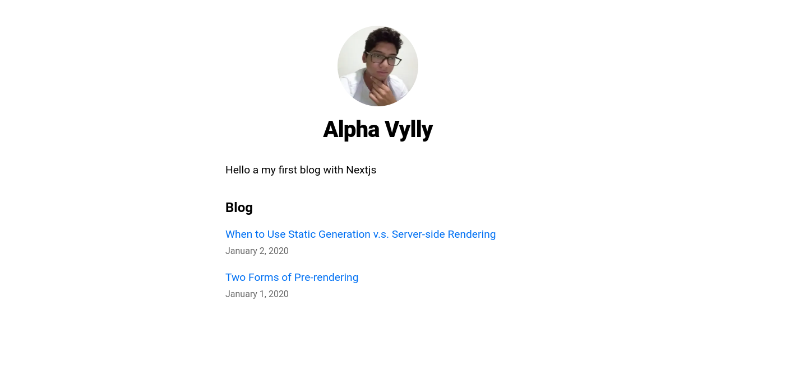

# Blog with [Next.js](https://nextjs.org/learn) 🔥

This mini blog project was made following the lessons of the Next.js documentation.

I was able to learn a lot from Next.js by following its own documentation. Its biggest features without a doubt such as Pre-rendering (SSG, SSR), Data Fetching, and also the most used method getStaticProps, in addition to getStaticPaths in Dynamic Routes.
## Tools 🧰
- [React](https://pt-br.reactjs.org)
- [Next.js](https://nextjs.org)
- [remark](https://www.npmjs.com/package/remark)
- [remark-html](https://www.npmjs.com/package/remark-html)
- [gray-matter](https://github.com/jonschlinkert/gray-matter)
- [date-fns](https://date-fns.org)

## Run project 🚧
Clone repository

```
git clone https://github.com/AlphaLawless/Blog-nextjs
```
Install dependencies
```
npm install
```
Run project
```
npm run dev
```
## [Deploy](https://blog-nextjs-ochre-eta.vercel.app/) 🚀



## Made by 👷🏽

<table>
  <tr>
    <td align="center">
      <a href="https://github.com/AlphaLawless">
        <br>
        <sub>
          <b>Alpha Vylly</b>
        </sub>
      </a>
    </td>
  </tr>
</table>
